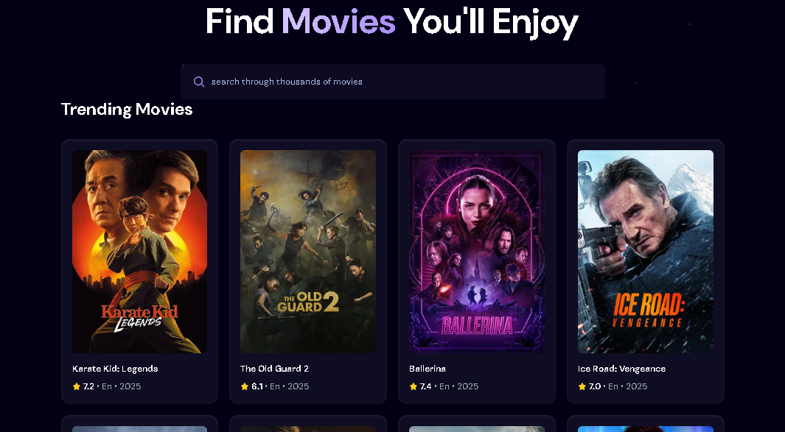

# 🎬 Moviehub

A sleek React web app to search and explore trending movies using the TMDB API.




---

## 🚀 Features

- 🔍 Live search with 500ms debounce
- 🌐 TMDB API integration
- 📈 Trending movies list
- ⚡ Loading spinner
- ❌ Error message handling
- 🎨 Responsive UI using Tailwind CSS

---

## 🛠️ Tech Stack

- React + Vite
- Tailwind CSS
- TMDB API

---

## 📦 Setup Instructions

### 1. Clone the repository

```bash
git clone https://github.com/Abhishek404Yadav/Moviehub.git
cd Moviehub
```

### 2. Install dependencies

```bash
npm install
```

### 3. Configure environment variables

Create a `.env` file in the root directory:

```
VITE_API_KEY=your_tmdb_api_key_here
```

> Get your API key from https://www.themoviedb.org/settings/api

### 4. Start the development server

```bash
npm run dev
```

Open http://localhost:5173 in your browser.

---

## 📂 Project Structure

```
src/
├── components/
│   ├── Search.jsx
│   ├── MovieCard.jsx
│   └── Loader.jsx
├── App.jsx
└── main.jsx
```

---

## 🌟 Future Improvements

- Movie detail modal/page
- Genre-based filtering
- Watchlist feature
- Dark mode toggle

---

## 🤝 Contributing

Feel free to fork, create a branch, and submit a pull request.

---

## 📄 License

Licensed under the [MIT License](LICENSE).

---

## 👨‍💻 Author

**Abhishek Yadav**  
📧 abhiyadav.ce@gmail.com  
🔗 [GitHub](https://github.com/Abhishek404Yadav)
